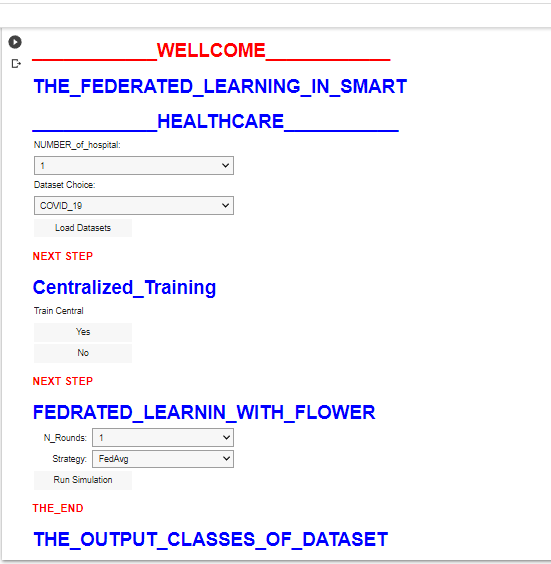

# Federated Learning for Smart Healthcare

## Authors
- [Thameur Bouberra](https://www.linkedin.com/in/thameur-bouberra-b022b1152/)

## Abstract
Federated Learning (FL) has emerged as a promising approach for training Machine Learning
(ML) models in decentralized settings, such as Smart Healthcare Systems (SHSs). This
project aims to investigate the effectiveness of FL in the context of SHSs by comparing
it with the traditional data-centralized approach. Specifically, four strategies of federated
learning are implemented using the Flower framework, with each strategy trained on four
different types of datasets: brain tumor, pneumonia, Alzheimer’s disease, and COVID-19.
The performance of these FL strategies is then compared to that of a data-centralized model
trained on the same datasets.
The experimental results reveal that the accuracy of the FL models is consistently lower
than that of the data-centralized model for all four strategies. This disparity in accuracy
suggests that the challenges associated with decentralized learning in SHS settings, such as
data heterogeneity, communication limitations, and variability in local datasets, may hinder
the performance of FL models.
#### Keywords:
Machine Learning (ML), Federated Learning (FL), Smart Healthcare Systems
(SHSs), Data Privacy, Decentralized Learning, Models Aggregation Methods
###  Flower Framework

The Flower framework is a distributed machine learning framework that enables the training of machine learning models on a decentralized network of devices. This repository provides instructions on how to install and use the Flower framework.

#### Requirements

- Python 3.6 or higher version

#### Installation

To install the stable version of Flower, you can use the Python package manager `pip`. Open your terminal or command prompt and run the following command:
`!pip install flwr `

### Strategies that we used

1. The FedAdam Strategy
2. The FedAdagrad Strategy
3. The FedProx Strategy
4. The FedAvg Strategy

### The number of client  that we used

1. N_client=2
2. N_client=5
3. N_client=10
4. N_client=15
5. N_client=20
### Dataset Links

- [Augmented Alzheimer MRI Dataset v2](https://www.kaggle.com/datasets/uraninjo/augmented-alzheimer-mri-dataset-v2)
- [Chest X-Ray Pneumonia Dataset](https://www.kaggle.com/datasets/paultimothymooney/chest-xray-pneumonia)
- [COVID-19 Radiography Database](https://www.kaggle.com/datasets/tawsifurrahman/covid19-radiography-database)
- [Brain Tumor Dataset](https://www.kaggle.com/datasets/preetviradiya/brian-tumor-dataset)
### The interface of Federated Learning for Smart Healthcare

